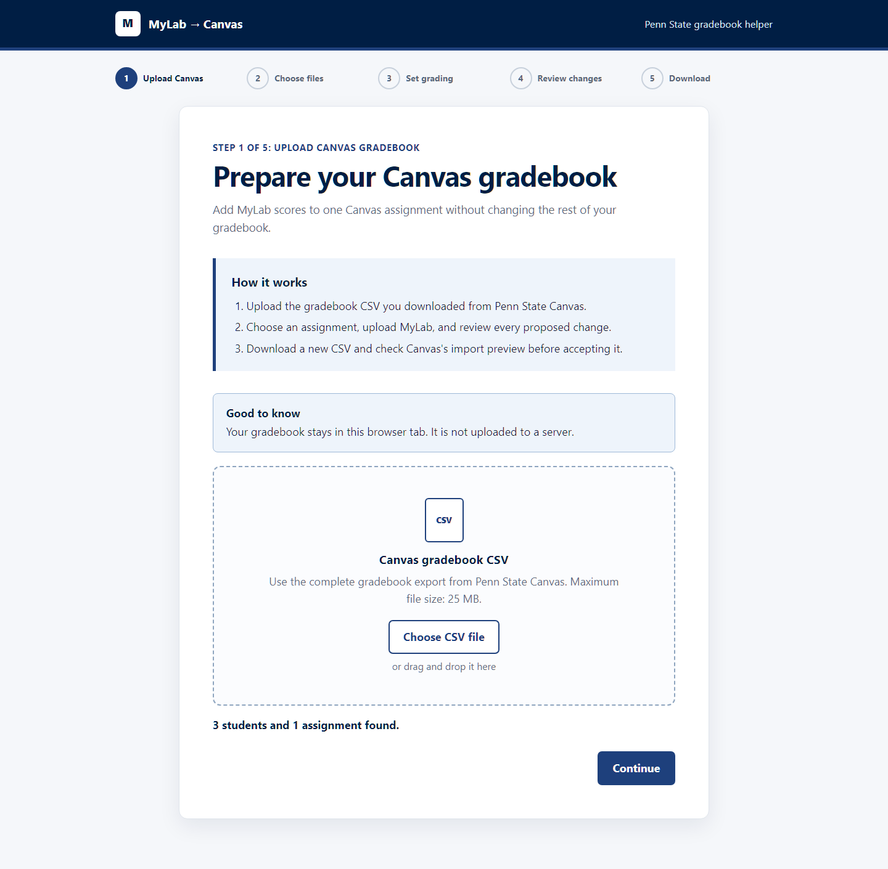
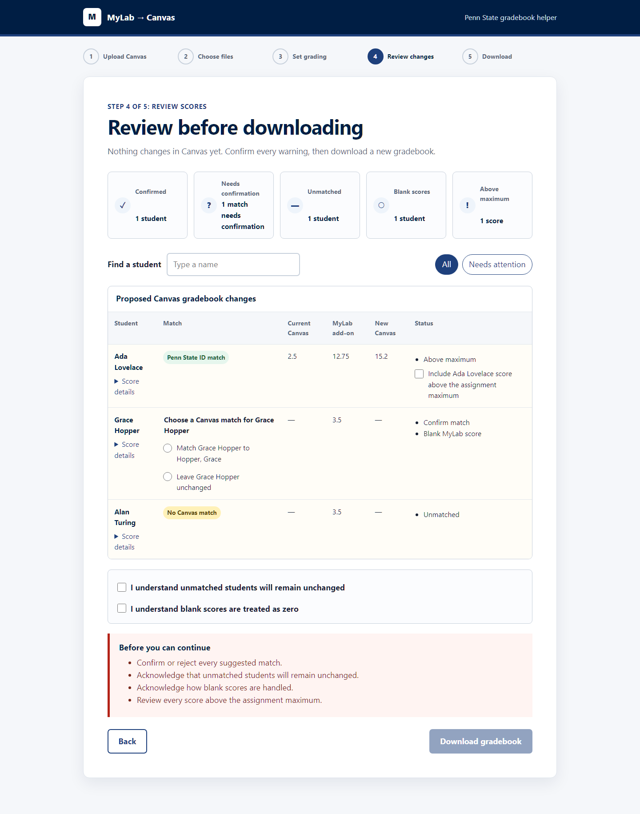
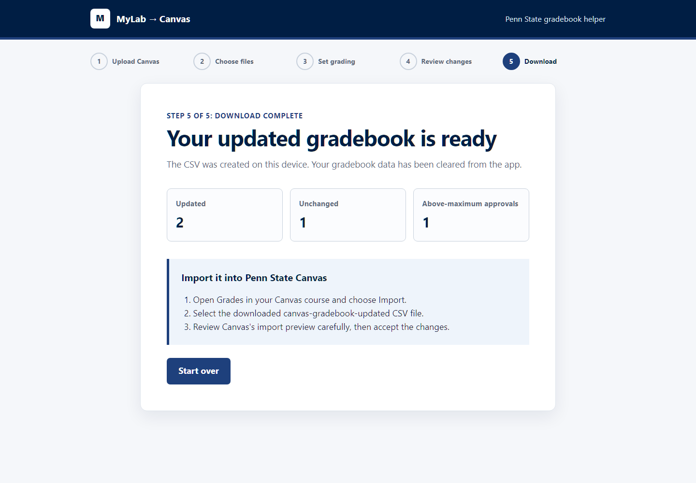

# MyLab to Canvas Gradebook

A small, private web app for Penn State math instructors. It adds MyLab section scores to one assignment in a Canvas gradebook export, lets the instructor review every proposed change, and downloads a new Canvas-compatible CSV.

The app runs entirely in the browser. Gradebook files and student data are not sent to a server. Only the preferred full-credit threshold is stored in the browser.

> [!IMPORTANT]
> This is an unofficial helper, not a Penn State, Instructure, or Pearson product. Always review Canvas's import preview before accepting grade changes.

## Workflow

### 1. Upload the Canvas gradebook

In Penn State Canvas, open the course gradebook, choose **Export**, and download the complete gradebook CSV. Add that file to the first screen. The app checks the layout and reports only student and assignment counts.



### 2. Choose the assignment and add MyLab

Select the Canvas assignment that should receive the MyLab points. In MyLab, export the detailed gradebook as CSV and add it to the app. The supported export contains section keys, a `Weight` row, an `Attempt` row, student email addresses, and normalized section scores from 0 through 1.

### 3. Configure grading

Choose a whole-number full-credit threshold from 1% through 100%. Drag the slider, use minus/plus, or click the underlined percentage to edit it. The default is 80%. Check or edit the point value detected for every MyLab section. Fractional values such as 2.5 are supported, and zero disables a section without blocking the workflow.

The assignment summary shows Canvas's full points possible, the total MyLab allocation, and the room left for existing Canvas scores. If full MyLab credit could exceed the assignment maximum, adjust the section points or confirm the split in the dialog shown by Continue to review. This planning check does not replace individual above-maximum approvals during review.

For a section score `s`, threshold `t`, and section weight `w`:

```text
if s >= t: adjusted = w
otherwise: adjusted = w × ceil((s + (1 - t)) × 10) / 10
```

The adjusted section values are added to the existing score in the selected Canvas assignment. The result is rounded to one decimal place using round-half-to-even behavior.

### 4. Review every proposed score

The review screen shows the current Canvas score, calculated MyLab addition, new Canvas score, and all warnings. Hover over, focus, or tap a **MyLab add-on** value to inspect its section scores. Match icons appear beside each student's name.



Automatic matches use the MyLab email and Canvas `SIS Login ID`. Penn State addresses match the corresponding account name with or without `@psu.edu`. Names can produce suggestions, but the app never accepts a name suggestion automatically.

Before download, the instructor must:

- confirm or reject every suggested or duplicate match;
- acknowledge unmatched students, which remain unchanged;
- acknowledge that blank Canvas and MyLab scores are treated as zero;
- approve each calculated score above the assignment maximum.

Invalid numeric content blocks the download. The app changes only confirmed student cells in the selected assignment column. It preserves the remaining Canvas rows and columns.

### 5. Download and import

Download the generated `canvas-gradebook-updated-YYYY-MM-DD.csv`. Use Save as to choose a location in supported browsers, from the Save arrow menu, or Save for a standard browser download. Toasts report the result. Back returns to review with your decisions intact; Start over clears the gradebook data held in this tab.



Back in Canvas, import the downloaded file and inspect the import preview carefully. Keep the original Canvas export until the updated grades have been verified.

## Browser and format requirements

- A current desktop version of Chrome or Edge is recommended.
- Each CSV must be 25 MB or smaller.
- Use a complete Penn State Canvas gradebook export with `Student`, `SIS User ID`, `SIS Login ID`, and a `Points Possible` row.
- Assignment headers must include Canvas's numeric assignment identifier in parentheses.
- Use the detailed MyLab CSV layout described above. The parser supports one or more sections and preserves fractional weights.

Processing happens locally in a dedicated browser worker. The deployed site does not need a database, server function, secret, or account connection.

## Codebase structure

| Path | Purpose |
| --- | --- |
| `src/app/` | Wizard state, controller, and threshold-only preference storage. |
| `src/csv/` | CSV text/file parsing, Canvas and MyLab layout validation, browser worker, and Canvas export. |
| `src/domain/` | Pure score formula, conservative matching, review policy, and shared types. |
| `src/ui/react/` | All five wizard screens, built with React and Astryx components. |
| `src/themes/neutral/` | Editable Penn State theme derived from Astryx neutral, plus generated runtime files. |
| `tests/unit/` | Formula, parser, matching, state, export, and Vercel configuration tests. |
| `tests/e2e/` | Chromium/tablet workflow, privacy, accessibility, download, and screenshot tests. |
| `tests/fixtures/anonymized/` | Synthetic gradebooks safe for tests and documentation. |
| `scripts/check-bundle-size.mjs` | Enforces the 200 KiB compressed JavaScript budget for React/Astryx. |
| `vercel.json` | Static Vite build settings and restrictive response headers. |

## Local development

Requirements:

- Node.js 24
- npm

Install and start the development server:

```powershell
npm ci
npm run dev
```

Open the local URL printed by Vite. Production files are generated in `dist`:

```powershell
npm run build
npm run preview
```

The project pins TypeScript 7.0.2. Its `tsc` command uses Microsoft's native TypeScript compiler implemented in Go. The shipped website is still ordinary static HTML, CSS, and JavaScript and requires no Go service.

The full application uses React 19 and Astryx 0.5.2 with navy accents, light surfaces, and locally bundled Google Sans Flex. There are no runtime Google Fonts requests. See [the design system notes](docs/design-system.md) for theme editing and component conventions.

## Verification

```powershell
npm run typecheck
npm test
npm run test:coverage
npm run test:e2e
npm run test:e2e:edge
npm run check:size
npm run docs:screenshots
```

`npm run test:e2e` runs Chromium desktop and tablet projects at full local CPU concurrency. Edge has a separate command so environments without the Edge channel can still run the main suite.

Never commit real gradebooks or screenshots containing student data.

## Vercel deployment

The repository is ready for a static Vercel project:

- framework: Vite;
- build command: `npm run build`;
- output directory: `dist`;
- no rewrites or server functions;
- a Content Security Policy with network connections disabled for the app;
- anti-framing, no-referrer, MIME sniffing, and device-permission restrictions.

Import the repository into Vercel and review the detected settings before the first deployment. No environment variables or secrets are required.

## Current limitations

- The app supports the current Penn State Canvas and tested MyLab CSV layouts. Vendor export changes may require parser updates.
- It prepares a CSV but does not change Canvas directly.
- Name-based matches always require instructor confirmation.
- Automated accessibility checks cover common WCAG failures, but they do not replace testing with the assistive technology used by an instructor.
- The final release check remains manual: import the generated file into Canvas's preview and confirm the selected assignment changes before accepting it.

## Legacy guide

The original PowerPoint introduced the command-line workflow and motivated the browser redesign. Its setup path is obsolete and several slides contained private material, so the source deck is intentionally excluded from the public project.
