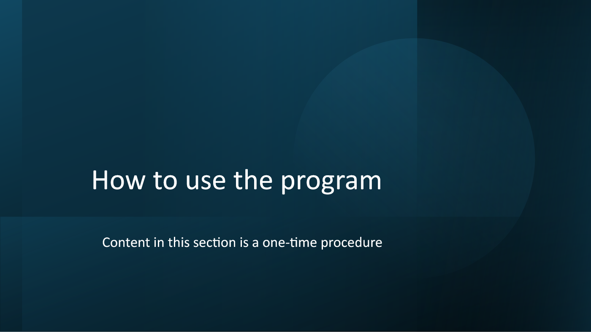
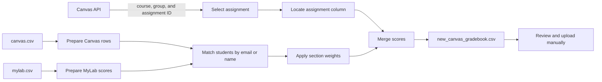
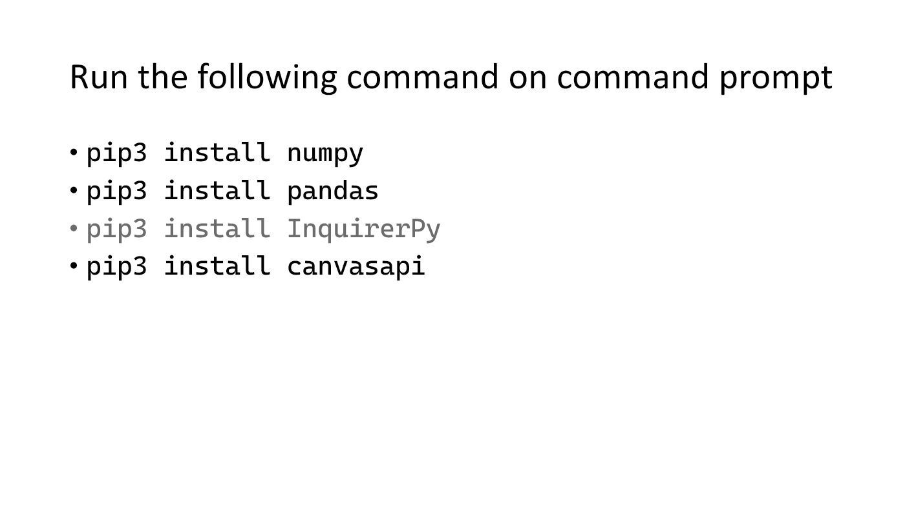
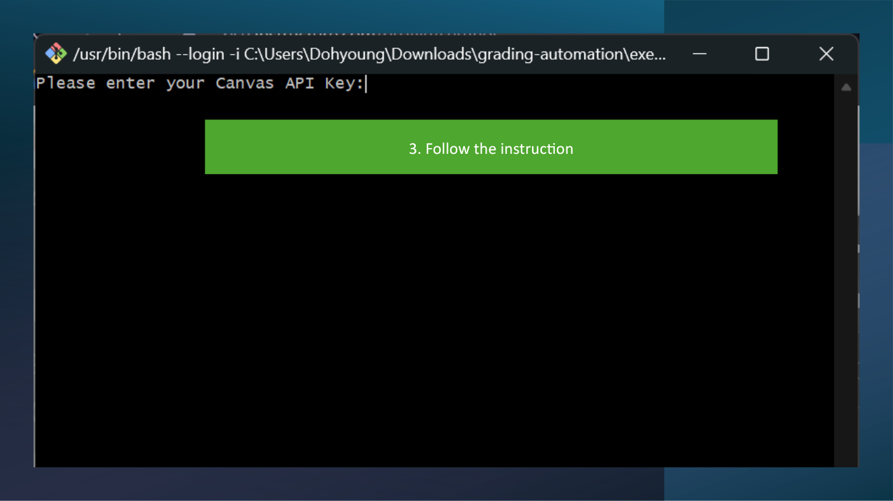

# Canvas–MyLab Gradebook Merger



This repository contains a command-line tool that combines grades from a Canvas gradebook export and a Pearson MyLab Math export. It uses the Canvas API to let an instructor or teaching assistant select a course and assignment, calculates adjusted MyLab scores, writes those scores into a copy of the Canvas gradebook, and saves the result as `new_canvas_gradebook.csv` for manual review and upload.

> [!IMPORTANT]
> A valid Canvas personal access token is required to select a course and assignment. The current repository owner no longer has a valid token, so the complete workflow has not been tested against Canvas. The program writes a local CSV; it does not upload grades through the API.

## Workflow



The score adjustment for each MyLab section follows the implementation in `adjust()`:

- A normalized score of at least `0.8` receives the full configured section weight.
- Lower scores use `weight × ceil((score + 0.2) × 10) / 10`.
- Adjusted section scores are added to the existing score for the selected Canvas assignment.

## Repository structure

| Path | Purpose |
| --- | --- |
| `grading-script.py` | Main program. Handles Canvas selection, CSV preprocessing, identity matching, score adjustment, merging, and output. |
| `execute.sh` | Minimal Bash launcher for `grading-script.py`. Intended for Git Bash, WSL, Linux, or macOS rather than native PowerShell. |
| `templates/index.html` | Unconnected web-form prototype. No Flask/FastAPI server or route currently renders or processes it. |
| `env/math_grader_env.yml` | Legacy Conda environment draft. It currently contains a misspelled `dependenies` key and omits `InquirerPy`; use the virtual-environment instructions below instead. |
| `How to use the program.pptx` | Original 15-slide setup and usage guide. Some slides contain an old token and student-identifying information; redact them before sharing the deck. |
| `canvas.csv` | Expected Canvas input filename. Contains protected student data. |
| `mylab.csv` | Expected MyLab input filename. Contains protected student data. |
| `new_canvas_gradebook.csv` | Generated Canvas-compatible output. Review it before uploading. |
| `canvas-old-gradebook-compare/` | Historical Canvas input snapshots used for manual comparisons. |
| `mylab-gradebook-compare/` | Historical MyLab snapshots used for manual comparisons. |
| `canvas-new-gradebook-compare/` | Historical generated outputs used for manual comparisons. |
| `.serena/` | Serena project configuration and local semantic-index metadata. |

## Requirements

- Python 3
- `numpy`
- `pandas`
- `canvasapi`
- `InquirerPy`
- A Canvas personal access token with access to the target course
- A Canvas gradebook CSV and a MyLab gradebook CSV in the layouts expected by the script

CanvasAPI expects the institution's Canvas base URL and an access token. This project currently fixes the base URL to Penn State Canvas in `grading-script.py`; change `API_URL` before using another Canvas installation.

## Install

PowerShell:

```powershell
py -3 -m venv .venv
.\.venv\Scripts\Activate.ps1
python -m pip install --upgrade pip
python -m pip install numpy pandas canvasapi InquirerPy
```

Bash:

```bash
python3 -m venv .venv
source .venv/bin/activate
python -m pip install --upgrade pip
python -m pip install numpy pandas canvasapi InquirerPy
```



The repository does not currently provide a working lockfile or requirements file, so installs are not reproducible across time.

## Prepare the gradebooks

### Canvas

1. Open the course gradebook in Canvas.
2. Filter the gradebook to the assignment that will receive the merged score.
3. Export the current gradebook view.
4. Rename the downloaded file to `canvas.csv`.
5. Place it in the repository root beside `grading-script.py`.

The parser expects Canvas metadata in the first two data rows and a totals or metadata row at the end. It preserves only `Student`, `SIS Login ID`, and the column whose name contains the selected Canvas assignment ID.

### MyLab Math

1. Export a MyLab gradebook whose section scores are normalized from `0` to `1`.
2. Keep one score column for each section that contributes to the Canvas assignment.
3. Rename the file to `mylab.csv`.
4. Place it in the repository root.

The current parser relies on fixed column positions, four leading metadata rows, and seven trailing summary rows. Verify the export layout before running the program because Pearson export formats may differ.

## Run

From the repository root:

```powershell
python grading-script.py
```

Or from Bash:

```bash
./execute.sh
```

The terminal will ask you to:

1. Enter a Canvas personal access token.
2. Select a course where you are enrolled as a teaching assistant.
3. Select an assignment group and assignment.
4. Confirm the selection.
5. Keep or change each MyLab section weight.



The token is currently entered with ordinary `input()`, so it remains visible in the terminal. Do not record the session or share screenshots. A future version should use hidden input or OAuth.

## Review the output

If processing succeeds, the program writes `new_canvas_gradebook.csv` in the repository root. Before uploading it to Canvas:

1. Keep an untouched copy of the original Canvas export.
2. Compare student counts and the selected assignment column.
3. Review every unmatched-student warning printed by the script.
4. Spot-check adjusted totals against the source gradebooks.
5. Upload the reviewed CSV manually through Canvas.

## Data protection

The CSV files and several original guide slides contain student names, institutional IDs, email addresses, and grade data. Treat them as protected education records.

- Do not commit real gradebooks or rendered screenshots of them to a public repository.
- Replace historical comparison data with anonymized fixtures before sharing the project.
- Treat any token shown in the original PowerPoint as compromised, even if it has expired.
- Delete local exports according to institutional retention policy after grades are verified.

## Known limitations

- Live execution stops without a valid Canvas token; there is no offline assignment-selection mode.
- Importing `grading-script.py` immediately prompts for a token and runs the application, which prevents straightforward unit testing.
- CSV parsing depends on hard-coded row and column positions.
- Student matching falls back to substring checks on normalized names and can produce ambiguous matches.
- An unmatched MyLab student can leave `canvas_score` undefined in `sumScores()`.
- Cancelling course or assignment selection returns `None`, but the caller only checks for `0`.
- The dependency environment file is invalid and dependencies are not pinned.
- The HTML form has no backend and should be treated as a mockup.
- There are no automated tests, structured logs, input previews, or rollback mechanism.

## Recommended next steps

1. Separate Canvas access, CSV parsing, matching, grading rules, and output into testable modules.
2. Add an offline mode that accepts an assignment column directly.
3. Validate input schemas and show a preview before writing output.
4. Replace name-substring matching with deterministic identifiers plus a manual review queue.
5. Add anonymized fixtures and unit tests for parsing, adjustment boundaries, unmatched students, and output preservation.
6. Decide between a polished CLI and a real local web interface; remove the unused HTML prototype if the CLI remains the product.

